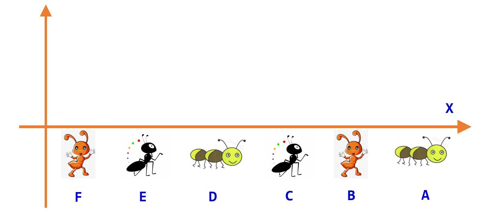

# P1310:蚂蚁王国的越野跑
------

总时间限制: 1000ms 内存限制: 262144kB

### 描述

为了促进蚂蚁家族身体健康，提高蚁族健身意识，蚂蚁王国举行了越野跑。假设越野跑共有N个蚂蚁参加，在一条笔直的道路上进行。N个蚂蚁在起点处站成一列，相邻两个蚂蚁之间保持一定的间距。比赛开始后，N个蚂蚁同时沿着道路向相同的方向跑去。换句话说，这N个蚂蚁可以看作x轴上的N个点，在比赛开始后，它们同时向X轴正方向移动。假设越野跑的距离足够远，这N个蚂蚁的速度有的不相同有的相同且保持匀速运动，那么会有多少对参赛者之间发生“赶超”的事件呢？此题结果比较大。

### 输入

第一行1个整数N。  
第2… N +1行：N 个非负整数，按从前到后的顺序给出每个蚂蚁的跑步速度。对于50%的数据，2<=N<=1000。对于100%的数据，2<=N<=100000。

### 输出

一个整数，表示有多少对参赛者之间发生赶超事件。 

### 样例输入

5  
1  
5  
10  
7  
6  
  
5  
1  
5  
5  
7  
6  

### 样例输出

7  
  
8  

### 提示

我们把这5个蚂蚁依次编号为A,B,C,D,E，假设速度分别为1,5,5,7,6。在跑步过程中：B,C,D,E均会超过A，因为他们的速度都比A快；D,E都会超过B,C，因为他们的速度都比B,C快；D,E之间不会发生赶超，因为速度快的起跑时就在前边；B,C之间不会发生赶超，因为速度一样，在前面的就一直在前面。  

考虑归并排序的思想。