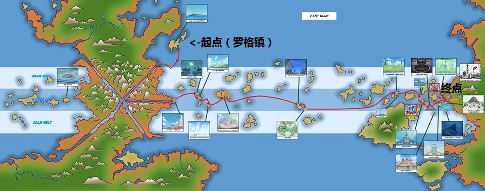

# P1160:海贼王之伟大航路

### 总时间限制: 

  1000ms

### 内存限制: 

  65536kB

### 描述

  “我是要成为海贼王的男人！”，路飞一边喊着这样的口号，一边和他的伙伴们一起踏上了伟大航路的艰险历程。

  

路飞他们伟大航路行程的起点是罗格镇，终点是拉夫德鲁（那里藏匿着“唯一的大秘宝”——ONE PIECE）。而航程中间，则是各式各样的岛屿。因为伟大航路上的气候十分异常，所以来往任意两个岛屿之间的时间差别很大，从A岛到B岛可能需要1天，而从B岛到A岛则可能需要1年。当然，任意两个岛之间的航行时间虽然差别很大，但都是已知的。现在假设路飞一行从罗格镇（起点）出发，遍历伟大航路中间所有的岛屿（但是已经经过的岛屿不能再次经过），最后到达拉夫德鲁（终点）。假设他们在岛上不作任何的停留，请问，他们最少需要花费多少时间才能到达终点？

### 输入

输入数据包含多行。 第一行包含一个整数N(2 < N ≤ 16)，代表伟大航路上一共有N个岛屿（包含起点的罗格镇和终点的拉夫德鲁）。其中，起点的编号为1，终点的编号为N。 之后的N行每一行包含N个整数，其中，第i(1 ≤ i ≤ N)行的第j(1 ≤ j ≤ N)个整数代表从第i个岛屿出发到第j个岛屿需要的时间t(0 < t < 10000)。第i行第i个整数为0。

### 输出

输出为一个整数，代表路飞一行从起点遍历所有中间岛屿（不重复）之后到达终点所需要的最少的时间。

### 样例输入
~~~
样例输入1： 
4 
0 10 20 999 
5 0 90 30 
99 50 0 10 
999 1 2 0 

样例输入2： 
5 
0 18 13 98 8 
89 0 45 78 43  
22 38 0 96 12 
68 19 29 0 52 
95 83 21 24 0
~~~
### 样例输出
~~~
样例输出1： 100 
样例输出2： 137
~~~
### 提示

提示： 

对于样例输入1：路飞选择从起点岛屿1出发，依次经过岛屿3，岛屿2，最后到达终点岛屿4。花费时间为20+50+30=100。 

对于样例输入2：可能的路径及总时间为： 1,2,3,4,5: 18+45+96+52=211 1,2,4,3,5: 18+78+29+12=137 1,3,2,4,5: 13+38+78+52=181 1,3,4,2,5: 13+96+19+43=171 1,4,2,3,5: 98+19+45+12=174 1,4,3,2,5: 98+29+38+43=208 所以最短的时间花费为137 

单纯的枚举在N=16时需要14!次运算，一定会超时。
