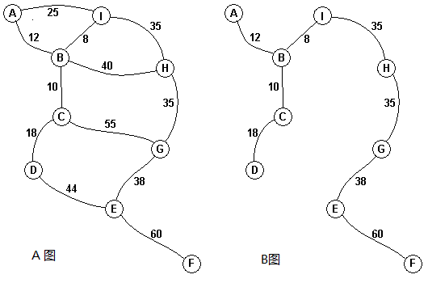

# P1282:兔子与星空

总时间限制: 1000ms 内存限制: 10000kB
# 描述
很久很久以前，森林里住着一群兔子。兔子们无聊的时候就喜欢研究星座。如图所示，天空中已经有了n颗星星，其中有些星星有边相连。兔子们希望删除掉一些边，然后使得保留下的边仍能是n颗星星连通。他们希望计算，保留的边的权值之和最小是多少？

## 输入
第一行只包含一个表示星星个数的数n，n不大于26，并且这n个星星是由大写字母表里的前n个字母表示。接下来的n-1行是由字母表的前n-1个字母开头。最后一个星星表示的字母不用输入。对于每一行，以每个星星表示的字母开头，然后后面跟着一个数字，表示有多少条边可以从这个星星到后面字母表中的星星。如果k是大于0，表示该行后面会表示k条边的k个数据。每条边的数据是由表示连接到另一端星星的字母和该边的权值组成。权值是正整数的并且小于100。该行的所有数据字段分隔单一空白。该星星网络将始终连接所有的星星。该星星网络将永远不会超过75条边。没有任何一个星星会有超过15条的边连接到其他星星（之前或之后的字母）。在下面的示例输入，数据是与上面的图相一致的。
## 输出
输出是一个整数，表示最小的权值和
## 样例输入
9
A 2 B 12 I 25
B 3 C 10 H 40 I 8
C 2 D 18 G 55
D 1 E 44
E 2 F 60 G 38
F 0
G 1 H 35
H 1 I 35
## 样例输出
216