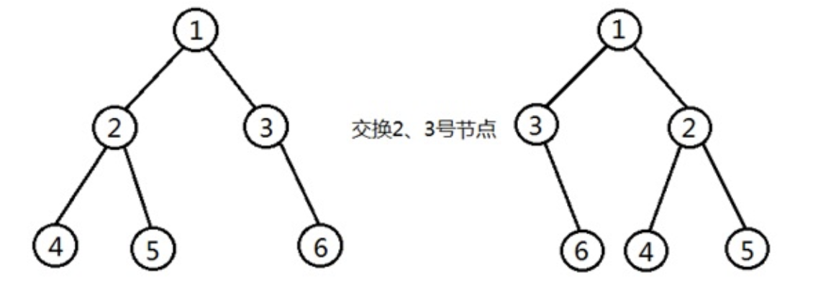
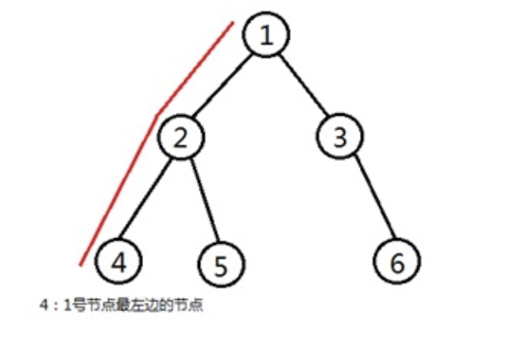

# 25TF1:二叉树的操作
------

总时间限制: 1000ms 内存限制: 65535kB

### 描述

给定一棵二叉树，在二叉树上执行两个操作：
1. 节点交换
把二叉树的两个节点交换。

2. 前驱询问
询问二叉树的一个节点对应的子树最左边的节点。


### 输入

第一行输出一个整数t(t <= 100)，代表测试数据的组数。

对于每组测试数据，第一行输入两个整数n m，n代表二叉树节点的个数，m代表操作的次数。

随后输入n行，每行包含3个整数X Y Z，对应二叉树一个节点的信息。X表示节点的标识，Y表示其左孩子的标识，Z表示其右孩子的标识。

再输入m行，每行对应一次操作。每次操作首先输入一个整数type。

当type=1，节点交换操作，后面跟着输入两个整数x y，表示将标识为x的节点与标识为y的节点交换。输入保证对应的节点不是祖先关系。

当type=2，前驱询问操作，后面跟着输入一个整数x，表示询问标识为x的节点对应子树最左的孩子。

1<=n<=100，节点的标识从0到n-1，根节点始终是0.
m<=100

### 输出

对于每次询问操作，输出相应的结果。

### 样例输入

```
2
5 5
0 1 2
1 -1 -1
2 3 4
3 -1 -1
4 -1 -1
2 0
1 1 2
2 0
1 3 4
2 2
3 2
0 1 2
1 -1 -1
2 -1 -1
1 1 2
2 0
```

### 样例输出

```
1
3
4
2
```


