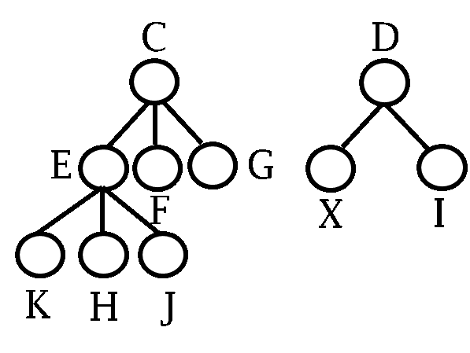

## P0770:森林的带度数层次序列存储
查看提交统计提问
总时间限制: 1000ms 内存限制: 65536kB

### 描述
对于树和森林等非线性结构，我们往往需要将其序列化以便存储。有一种树的存储方式称为带度数的层次序列。我们可以通过层次遍历的方式将森林序列转化为多个带度数的层次序列。

例如对于以下森林：

两棵树的层次遍历序列分别为：C E F G K H J / D X I

每个结点对应的度数为：3 3 0 0 0 0 0 / 2 0 0

我们将以上序列存储起来，就可以在以后的应用中恢复这个森林。在存储中，我们可以将第一棵树表示为C 3 E 3 F 0 G 0 K 0 H 0 J 0，第二棵树表示为D 2 X 0 I 0。

现在有一些通过带度数的层次遍历序列存储的森林数据，为了能够对这些数据进行进一步处理，首先需要恢复他们。

### 输入

输入数据的第一行包括一个正整数n，表示森林中非空的树的数目。
随后的 n 行，每行给出一棵树的带度数的层次序列。
树的节点名称为A-Z的单个大写字母。

### 输出

输出包括一行，输出对应森林的后根遍历序列。

### 样例输入
2
C 3 E 3 F 0 G 0 K 0 H 0 J 0
D 2 X 0 I 0
### 样例输出
K H J E F G C X I D