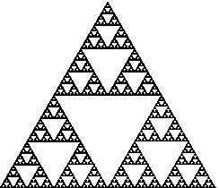

## P0360:The Sierpinski Fractal

总时间限制: 1000ms

内存限制: 65536kB

- 描述

  Consider a regular triangular area, divide it into four equal triangles of half height and remove the one in the middle. Apply the same operation recursively to each of the three remaining triangles. If we repeated this procedure infinite times, we'd obtain something with an area of zero. The fractal that evolves this way is called the Sierpinski Triangle. Although its topological dimension is 2, its Hausdorff-Besicovitch dimension is log(3)/log(2)~1.58, a fractional value (that's why it is called a fractal). By the way, the Hausdorff-Besicovitch dimension of the Norwegian coast is approximately 1.52, its topological dimension being 1.  For this problem, you are to outline the Sierpinski Triangle up to a certain recursion depth, using just ASCII characters. Since the drawing resolution is thus fixed, you'll need to grow the picture appropriately. Draw the smallest triangle (that is not divided any further) with two slashes, to backslashes and two underscores like this: 

  ```
   /\
  /__\
  ```

  To see how to draw larger triangles, take a look at the sample output.

- 输入

  The input contains several testcases. Each is specified by an integer n. Input is terminated by n=0. Otherwise 1<=n<=10 indicates the recursion depth.

- 输出

  For each test case draw an outline of the Sierpinski Triangle with a side's total length of 2n characters. Align your output to the left, that is, print the bottom leftmost slash into the first column. The output must not contain any trailing blanks. Print an empty line after each test case.

- 样例输入

  ```
  3
  2
  1
  0
  ```

  

- 样例输出

  ```
         /\
        /__\
       /\  /\
      /__\/__\
     /\      /\
    /__\    /__\
   /\  /\  /\  /\
  /__\/__\/__\/__\
  
     /\
    /__\
   /\  /\
  /__\/__\
  
   /\
  /__\
  ```

- 提示：



